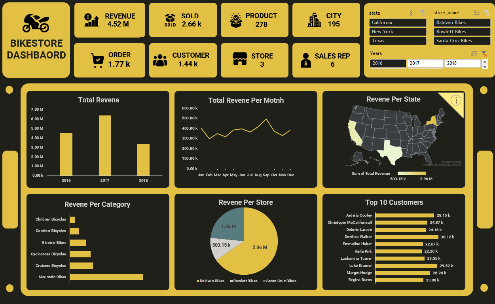

# Bike Store Sales Analysis Report

## Created by - Muzamil Channa @ Aspiring Data Analyst [Linkedin Profile](https://www.linkedin.com/in/muzamil-channa-a2216a175/)

## Table of Contents
- [Objective](#objective)
- [Problem Statement](#problem-statement)
- [Key Findings](#key-findings)
- [Recommendations](#recommendations)

#
  
#

###### This report provides a detailed analysis of the bikestore's sales performance, leveraging insights from various data points to inform strategic decision-making.

### Objective:
- Gain a clear understanding of sales trends within the bikestore data.
- Identify top-performing stores, categories, sales representatives, and customers.
- Analyze patterns in revenue, orders, units sold, and product mix across different dimensions.

## Problem Statement
We need to utilize the bikestore data to create insightful reports that can guide effective business strategies. These reports should address key performance indicators (KPIs) across various aspects, including:

- Geography (state, city)
- Sales channels (store, sales rep)
- Customer segmentation (top customers)
- Product categories
- Timeframe (year, month)

## Key Findings

### Sales Representative Performance Analysis:
- Venita Daniel consistently ranks as the top performer in sales revenue.
- Significant variations exist among sales representatives, suggesting a need for further analysis to identify improvement areas.
- State-level performance variations point towards potential territory assignment refinements.

### Store Performance Analysis:
- Revenue generated by stores varies considerably. Understanding factors influencing store success is crucial.
- While the top-performing store is located in New York, geographical location alone might not be the sole determinant.

### Top Customer Analysis:
- Identifying top customers and their purchasing behaviors allows for targeted marketing efforts and customer loyalty programs.
- Customer segmentation based on buying habits and demographics can further enhance marketing strategies.

### Regional Sales Performance:
- New York is the highest-revenue generating state, while California also presents significant sales potential. Texas might require further investigation.
- State-specific marketing campaigns tailored to category preferences (e.g., highlighting Road Bikes in New York) can be highly effective.

### Order Analysis and Sales Optimization:
- Order volume fluctuations necessitate further investigation into potential contributing factors.
- Variations in Average Order Value (AOV) across stores and states suggest opportunities for product mix adjustments, upselling strategies, and potentially pricing considerations.
- Targeted promotions, product bundling, and effective upselling/cross-selling techniques can be implemented to increase order frequency and AOV.

### Customer Base Analysis:
- Understanding the total number of unique customers (approximately 1,440) helps assess market reach and identify customer acquisition opportunities.

### Revenue Overview:
- Total revenue varied across years (2016: $4.52 million, 2017: $6.40 million, 2018: $3.37 million). The significant decrease in 2018 requires further investigation.

### Unit Sales Analysis:
- Road Bikes and Electric Bikes generate high revenue despite lower unit sales, suggesting potentially higher price points.
- Mountain Bikes and Cruisers Bicycles show a balance between unit sales and revenue, indicating potentially attractive price points.
- Cyclocross Bicycles and Children's Bicycles present contrasting scenarios, requiring further analysis regarding pricing and marketing strategies.

## Recommendations
Based on the analysis, several recommendations are proposed:

- Implement targeted marketing campaigns and promotions based on seasonal trends, regional preferences, and customer segmentation.
- Continuously monitor customer preferences and adjust product placement and marketing strategies accordingly.
- Conduct a deeper analysis of sales representative performance to identify areas for improvement and potentially refine territory assignments.
- Investigate factors contributing to store performance variations to understand what drives success.
- Develop targeted marketing efforts and potentially customer loyalty programs to retain top customers.
- Implement regional sales strategies based on revenue potential and category preferences.
- Analyze reasons behind order volume fluctuations and explore strategies to increase order frequency.
- Utilize AOV variations to identify opportunities for product mix adjustments, upselling techniques, and potentially pricing considerations.
- Investigate market dynamics for Cyclocross Bicycles and Children's Bicycles to determine appropriate pricing and marketing strategies.

#
#### Don't forget to give a star to this project because it motivates me, and please follow me on [LinkedIn](https://www.linkedin.com/in/muzamil-channa-a2216a175/). Also, please consider me for any internship or entry-level data analyst role. I need a job or internship even though it's free or paid. Thanks in Advance.

-Created & Presented by – Muzamil Channa @ Aspiring Data Analyst
-Date: 26/04/2024
-Place: Pakistan, Karachi

